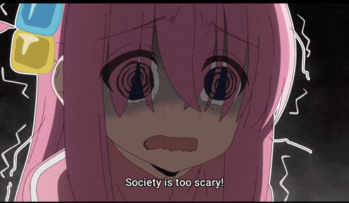

## About Me

I am a CS student at the University of Wollongong. My previous life involved studying Electrical and Electronic Engineering at Imperial College London, which mostly taught me how to handle hardware that hates me. 

Now, I spend my time trying to understand AI so I can eventually automate my own existence. I prefer working with data and neural networks because, unlike people, models have documentation (usually). I’m currently deep-diving into AI/Data Engineering, trying to figure out why my loss function is higher than my social battery.

---
### Apart from the Terminal

I am a cinephile who spends way too much time analyzing frames instead of touching grass. You can find the evidence of my cinematic obsession on [Letterboxd](https://letterboxd.com/XixianH/).

I also believe that public transport is the peak of human civilization because it requires zero interaction with a driver.

---

### Contact

If you have a legitimate reason to interrupt my solitude:

- Email: xixianhuang985@gmail.com
- LinkedIn: [linkedin.com/in/xixianhuang](https://www.linkedin.com/in/xixianhuang)
